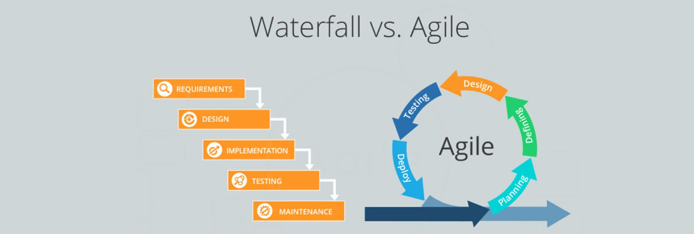

## Brais Moure comparte [12 Consejos para un JUNIOR de un SENIOR](https://www.youtube.com/watch?v=SavaU66KxQY)

### Utilizaremos el siguiente entorno en la nube para trabajar:   

## Algoritmos
Un algoritmo es un conjunto de instrucciones paso a paso que describe cómo realizar un cálculo, resolver un problema o realizar una tarea.

#### Algunos de los algoritmos de búsqueda comunes son:

| Tipo de Algoritmo | Descripción| Aplicaciones | Ventajas |
|------|------|------|------|
| Búsqueda Lineal (Linear Search) | Este algoritmo recorre secuencialmente cada elemento en una lista hasta encontrar el valor deseado | Útil para buscar elementos no ordenados en una lista pequeña o no indexada |Fácil de implementar y funciona bien en listas no ordenadas |
|Búsqueda Binaria (Binary Search)| Este algoritmo divide repetidamente a la mitad la lista de elementos y compara el valor deseado con el elemento central.| Ideal para buscar elementos en listas ordenadas.| Eficiente en listas ordenadas, ya que reduce el número de comparaciones necesarias.|

#### En cuanto a los algoritmos de ordenamiento, algunos ejemplos son:

| Tipo de Algoritmo | Descripción| Aplicaciones | Ventajas |
|------|------|------|------|
| Ordenamiento de Burbuja (Bubble Sort)| Compara pares de elementos adyacentes y los intercambia si están en el orden incorrecto. | Adecuado para listas pequeñas o casi ordenadas.| Fácil de implementar y entender.|
|Ordenamiento Rápido (Quick Sort)| Utiliza un elemento pivote para dividir la lista en dos sub-listas, y luego ordena recursivamente cada sub-lista. | Eficiente para listas grandes y desordenadas.| Rápido en listas grandes y ocupa menos espacio de memoria que otros algoritmos.|

Estos algoritmos son fundamentales en el desarrollo de software, ya que permiten buscar y organizar datos de manera eficiente, lo que es crucial para la optimización del rendimiento de las aplicaciones y la gestión de grandes volúmenes de información.

### 💻 [El siguiente articulo nos da una mejor perspectiva de los algoritmos en el ecosistema de la programación](https://github.com/LeonRamos5366/SmartTeach/blob/main/Programaci%C3%B3n/MProgramacion.pdf)

## Diagramas de Flujo
 
Los diagramas de flujo en programación son representaciones visuales de los pasos lógicos necesarios para resolver un problema o ejecutar un proceso. Estos diagramas utilizan símbolos gráficos para representar las diferentes etapas de un algoritmo o flujo de trabajo. Son esenciales para la comprensión de algoritmos complejos y la planificación de programas. 

Para utilizarlos de manera efectiva, es crucial comprender los símbolos estándar utilizados en los diagramas de flujo, como el inicio/fin, proceso, decisión, entrada/salida, y el flujo de control. La importancia de los diagramas de flujo radica en su capacidad para comunicar visualmente la lógica de un algoritmo, lo que facilita la comprensión y colaboración en el desarrollo de software.

Un ejemplo concreto de su aplicación es el diseño de un algoritmo de búsqueda lineal. El diagrama de flujo mostraría los pasos para recorrer secuencialmente una lista de elementos hasta encontrar el valor buscado.

Las mejores prácticas para crear y entender los diagramas de flujo incluyen mantener la simplicidad, usar colores para resaltar elementos clave, y etiquetar claramente cada símbolo. Es recomendable utilizar herramientas especializadas como Lucidchart, Draw.io o Microsoft Visio para crear diagramas de flujo de manera efectiva. 

## Programas
Un programa es un conjunto de instrucciones escritas en un lenguaje de programación específico que le indica a una computadora cómo realizar una tarea o resolver un problema. 

