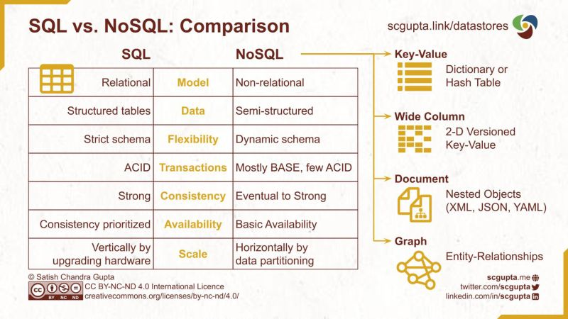

# Implementación de Sistemas de Información 
  Mtro. León Miguel Ramos Corchado

### Hola a tod@s👋,

## En este curso aprenderemos lo siguiente:
* ### Características de los Sistemas de Información
#### Objetivo: 
Comprender las características fundamentales de los sistemas de información, como la recopilación, procesamiento, almacenamiento y distribución de datos ademas de revisar la relevancia de la integridad, confidencialidad y disponibilidad de la información en los sistemas.

[🔗 Link : Características de los Sistemas de Información](https://github.com/LeonRamos5366/SmartTeach/blob/main/Caracteristicas_Sistemas/Caracteristicas.md)

* ### Conceptos de Programación
#### Objetivo: 
Analizar y comprender los conceptos básicos de programación, como variables, estructuras de control (bucles, condicionales), funciones y objetos. Considerando los dos paradigmas actuales de programación PED & POO.

[🔗 Git GitHub?](https://github.com/Hispano/Guia-sobre-Git-Github-y-Metodologia-de-Desarrollo-de-Software-usando-Git-y-Github)

 
***Explicando Conceptos Básicos de Programación***

| No. | Name | File |
|------|------|------|
|1.|Metodología de la Programación|[🔗 Link : Metodología Tradicional o Ágil](https://github.com/LeonRamos5366/SmartTeach/blob/main/Programaci%C3%B3n/Tradicional_vs_%C3%A1gil.pdf)|
|2.|Algoritmos, D. de flujo y Programas|[🔗 Link : De Junior hasta Senior](https://github.com/LeonRamos5366/SmartTeach/blob/main/Programaci%C3%B3n/Programaci%C3%B3n.md)|
|3.|Estructuras Algorítmicas Selectivas|[🔗 Link : if, if-else](https://github.com/JorgeDeLosSantos/apuntes-python/blob/master/Estructuras%20de%20control.ipynb)|
|4.|Estructuras Algorítmicas Repetitivas|[🔗 Link : while, do while, for](https://github.com/JorgeDeLosSantos/apuntes-python/blob/master/Funciones.ipynb)|
|5.|Programación Secuancial|[🔗 Link : Programación Secuencial](https://github.com/LeonRamos5366/SmartTeach/blob/main/Programaci%C3%B3nSecuencial.md))|
|6.|Estructuras de Datos|[🔗 Link : arreglos, pilas, colas, grafos](https://github.com/Mgobeaalcoba/data_structs_python/blob/main/README.md)
|7.|Matematicas Discretas|[🔗 Link : matemáticas discretas](https://github.com/LeonRamos5366/SmartTeach/blob/main/matematicasdiscretas.md)|
 

* ### Bases de Datos
#### Objetivo: Enteneder los fundamentos de las bases de datos, incluyendo los diferentes tipos de bases de datos (relacionales, NoSQL), el modelado de datos, consultas SQL y la importancia de la integridad de los datos.

Lenguaje SQL con Mysql [Aquí](https://github.com/jvadillo/guia-rapida-mysql/blob/master/README.md)

Compilador de Mysql Online [Aquí](https://paiza.io/en/projects/new?language=mysql)

* ### Implementación de aplicaciones Informáticas
#### Objetivo: Comprender la importancia de la implementación adecuada de aplicaciones informáticas, abordando temas como la arquitectura de software, el ciclo de vida del desarrollo de software, las metodologías ágiles y las pruebas de software.

 
  Visitor count 
  

#### Puedes apoyar mi trabajo haciendo "☆ Star" en el repo o nominarme a "GitHub Star". ¡Gracias!

 This work is licensed under a <a rel="license" href="http://creativecommons.org/licenses/by-nc-nd/4.0/">Creative Commons Attribution-NonCommercial-NoDerivatives 4.0 International License</a>.
